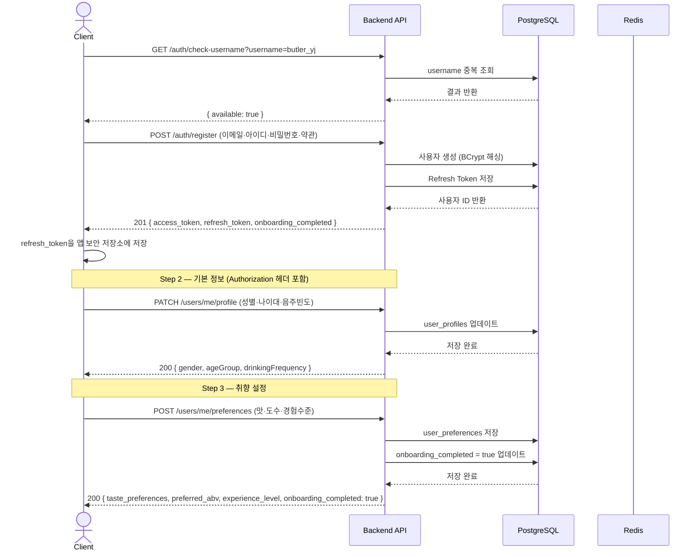
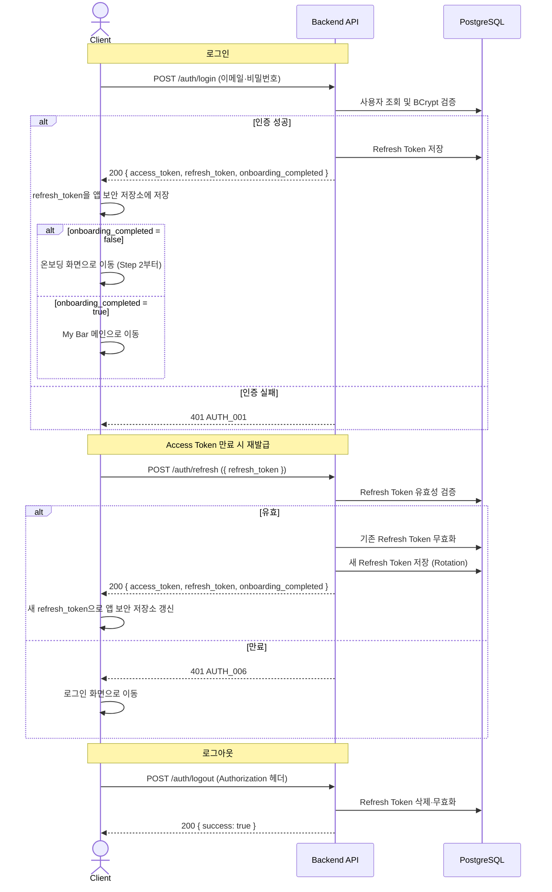
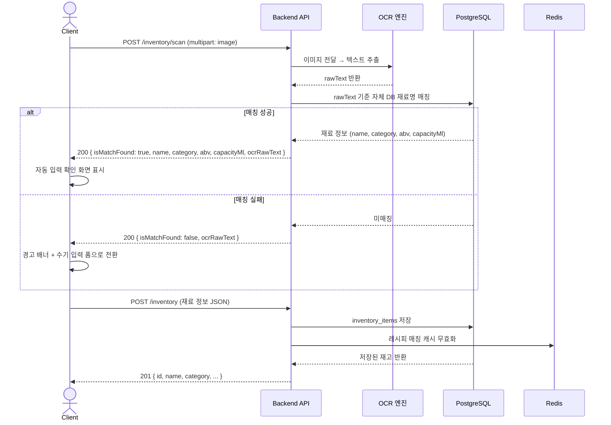
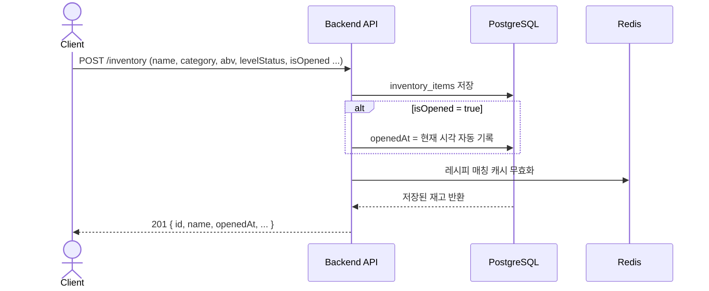
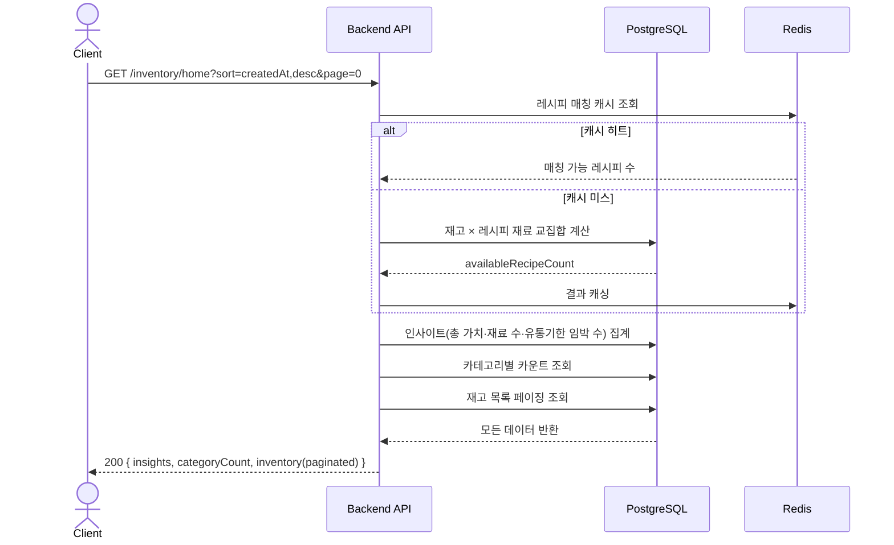
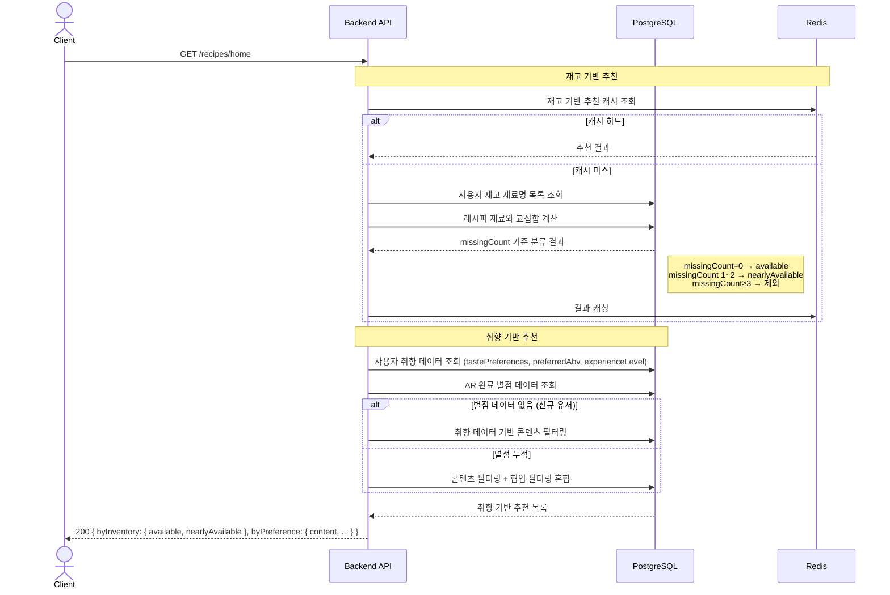
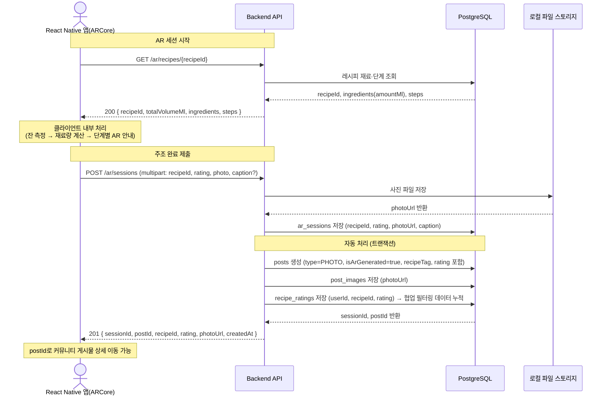
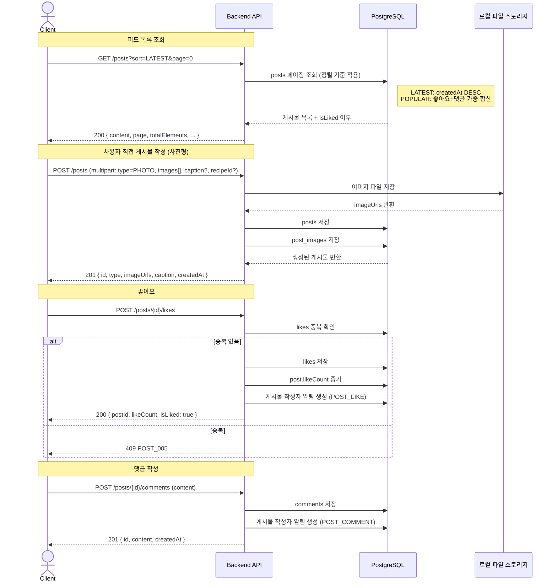
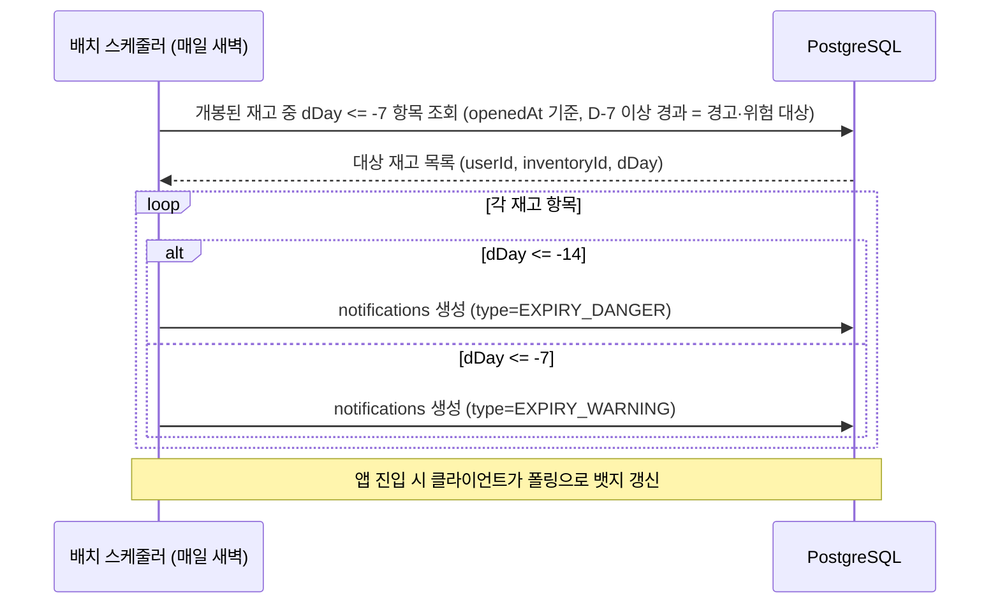
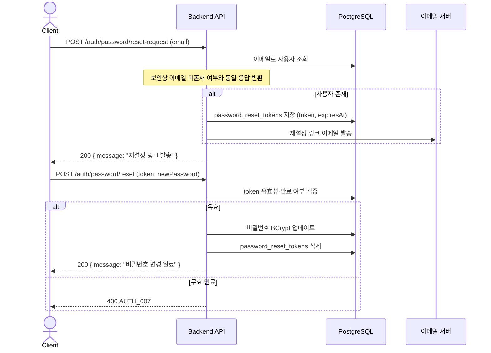

# 나만의 버틀러 — 시퀀스 다이어그램

> **버전:** v1 | **기준:** 서비스 기획서 v0.2 MVP

---

## 1. 회원가입 (온보딩 3단계)

---

## 2. 로그인 및 토큰 재발급

---

## 3. 재고 등록 — 라벨 스캔 흐름

---

## 4. 재고 등록 — 직접 입력 흐름

---

## 5. My Bar 메인 화면 로딩

---

## 6. 레시피 홈 — 추천 로딩

---

## 7. AR 주조 가이드 — 완료 → 커뮤니티 자동 업로드

---

## 8. 커뮤니티 피드 및 게시물 작성

---

## 9. 유통기한 알림 배치 처리

---

## 10. 비밀번호 재설정

